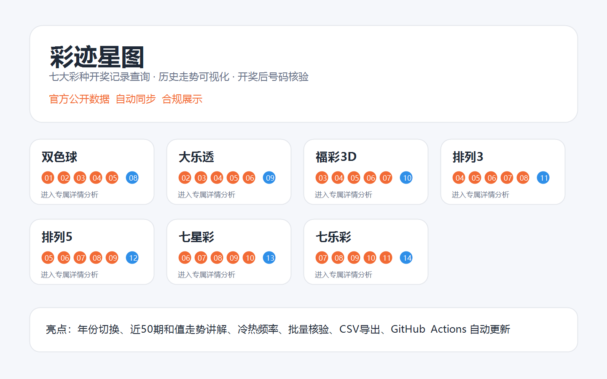

# 彩迹星图｜多彩种开奖记录查询与可视化核验工具



**彩迹星图** 是一款面向普通用户的多彩种彩票开奖记录查询、历史走势观察和开奖后号码核验工具。项目采用静态网页发布，打开网址即可使用；数据同步、页面生成和发布流程可以通过 GitHub Actions 自动完成，适合部署到 Netlify、GitHub Pages、Gitee Pages 等平台。

> 合规说明：本项目只整理和展示公开开奖信息，提供历史统计与开奖后核验参考；不销售彩票，不提供代购服务，不承诺中奖，不提供“必中/稳赚/预测准确”等内容。彩票开奖结果具有随机性，请理性参与，未成年人不得购买彩票。

## 功能特性

- **七大彩种入口**：支持双色球、大乐透、福彩3D、排列3、排列5、七星彩、七乐彩，每个彩种都有独立详情页。
- **官方数据同步**：从中国福彩网/中彩网、中国体彩网等公开渠道整理开奖数据，并展示最新同步日期、最新期号和数据来源。
- **历史记录查询**：完整保留历史开奖数据，支持按年份切换查看，避免用户在长表格里迷路。
- **号码频率统计**：用颜色、标签和进度条同时表达热号、冷号和常规号，降低图表理解门槛。
- **近50期走势讲解**：展示主号码区和值走势，并给出最新值、均值、最高值、最低值和较上一期变化说明。
- **中奖核验工具**：支持单注核验、批量核验、示例填入、清空结果和 CSV 导出，方便开奖后快速对号。
- **规则引擎设计**：不同彩种使用独立配置和核验规则，避免把双色球逻辑硬套到其他彩种上。
- **静态部署友好**：最终页面在 `release/` 目录中，浏览器直接打开或部署到静态托管平台即可访问。

## 创新点

- **多彩种平等架构**：不是一个双色球页面改改名字，而是通过 `lottery_config.py` 抽象彩种规则、号码区域、开奖来源和展示逻辑。
- **配置驱动页面生成**：新增彩种时优先补配置和规则，页面由 Python 自动生成，减少重复代码。
- **开奖后核验闭环**：从“查数据”延伸到“核对自己号码”，并支持批量导出，贴近真实用户场景。
- **解释型走势图**：走势图不仅画线，还告诉用户“每个点是什么意思、均线怎么看、它不能预测未来”。
- **自动更新链路**：抓取数据、生成页面、同步发布目录、提交更新可以由 GitHub Actions 定时执行。
- **合规优先设计**：所有推荐和统计都定位为历史观察，不触碰销售、代购、收益承诺或诱导倍投。

## 技术栈

- **Python 3**：数据抓取、数据清洗、页面生成、规则核验测试。
- **HTML / CSS / JavaScript**：静态网页、多页导航、年份筛选、中奖核验、CSV 导出。
- **JSON**：保存各彩种历史开奖数据。
- **GitHub Actions**：定时同步数据并重新生成静态页面。
- **Netlify / GitHub Pages / Gitee Pages**：可选静态网站托管平台。

## 目录结构

```text
.
├── double/                  # 核心源码、数据和本地生成页面
│   ├── build_dashboard.py   # 静态页面生成器
│   ├── fetch_data.py        # 开奖数据同步入口
│   ├── lottery_config.py    # 彩种配置
│   ├── lottery_rules.py     # 中奖核验规则
│   ├── lottery_sources.py   # 数据来源适配
│   ├── *_data.json          # 各彩种开奖数据
│   └── tests/               # 规则引擎测试
├── release/                 # 可直接部署的静态网页成品
├── scripts/                 # 发布同步和站点检查脚本
├── .github/workflows/       # 自动更新工作流
├── docs/                    # README 图片和项目说明资源
├── requirements.txt         # Python 依赖
└── README.md
```

## 使用方法

### 方式一：直接打开静态页面

如果只是本地查看，直接打开：

```text
release/index.html
```

进入首页后选择任意彩种，即可查看专属详情页。

### 方式二：启动本地服务

```bash
python -m http.server 8080 -d release
```

然后在浏览器打开：

```text
http://127.0.0.1:8080
```

### 方式三：部署到网站

把 `release/` 目录作为发布目录部署到 Netlify、GitHub Pages 或 Gitee Pages。部署后，用户只需要打开网址即可使用。

## 更新数据

安装依赖：

```bash
pip install -r requirements.txt
```

同步数据并重新生成页面：

```bash
python double/fetch_data.py
python double/build_dashboard.py
python scripts/sync_release.py
```

如果使用 GitHub Actions，仓库中的 `.github/workflows/update-lottery-data.yml` 会按计划自动执行同步。自动更新依赖官方公开接口、GitHub Actions 权限和托管平台部署状态；如果外部接口或平台规则变化，需要维护者检查并调整。

## 测试

```bash
$env:PYTHONPATH="./double"
python -B -m unittest discover -s double/tests -q
```

站点发布前可以检查静态页面是否包含关键内容：

```bash
python scripts/check_live_site.py
```

## 合规声明

本工具仅基于公开开奖数据进行整理、查询、核验和统计展示，不销售彩票，不提供代购服务，不构成任何中奖承诺、收益承诺或投资建议。页面中的频率、走势、和值、冷热号等内容只用于历史数据观察，不能预测未来开奖结果。中奖结果、奖级和兑奖规则以中国福彩网、中国体彩网等官方发布及销售机构规定为准。请理性参与，未成年人不得购买彩票。

## 项目定位

彩迹星图希望把复杂的开奖记录变成普通用户能看懂的页面：入口清楚、数据透明、核验方便、说明直白。它不是“预测工具”，而是一个更干净、更合规、更易用的开奖数据观察台。
